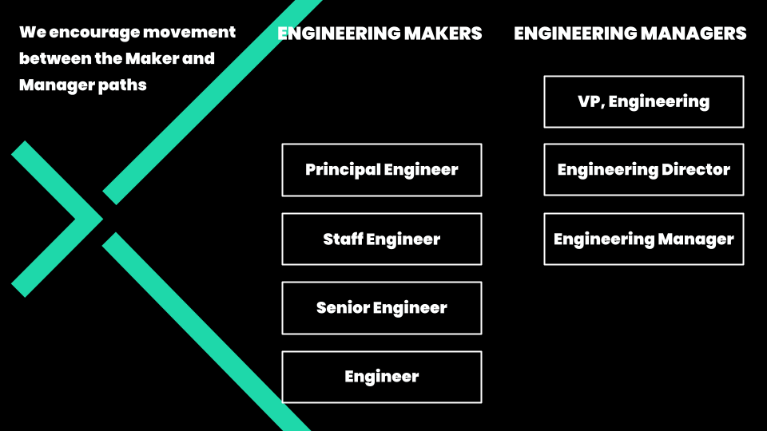

# engineering-ladder

### Exos Engineering Ladder

At Exos, we are tasked with an important and challenging mission: **to ignite the hero in all of us**. 
We believe that creating an Engineering Ladder will help us achieve our mission because when performance standards are clearly defined in an engineering ladder:

* It provides a level playing field that promotes equity.
* Engineers know how to grow and can see themselves continuously improve.
* Managers have consistent, objective criteria on which to base promotions and compensation.
* We know what to expect of ourselves and each other, so we can focus on doing great work together.

An Engineering Ladder is

An Engineering Ladder helps engineers understand how they can grow in their career and have the most impact. It helps managers set expectations with teams and hold them accountable for their work.

An Engineering Ladder is not

An Engineering Ladder is not a promotion checklist. It’s designed to help an engineer understand what impact could look like at each level. It is not an exhaustive list of categories and behaviors. We've chosen the most important categories for Exos and each includes a few key behaviors as guides. Managers will work with engineers on goals and expectations for their work. 

There are two paths in our Engineering Ladder:

**Makers:** impact team success by delivering the software and product that customers value. 
**Managers:** impact team success by delivering and developing the people into high performing teams.

### Makers path

* [Engineer](makers/engineer.md)
* [Senior Engineer](makers/senior-engineer.md)
* [Staff Engineer](makers/staff-engineer.md)
* [Principal Engineer](makers/principal-engineer.md)

### Managers path

* [Engineering Manager](managers/engineering-manager.md)
* [Engineering Director](managers/engineering-director.md)
* [VP, Engineering](managers/vp-engineering.md)

